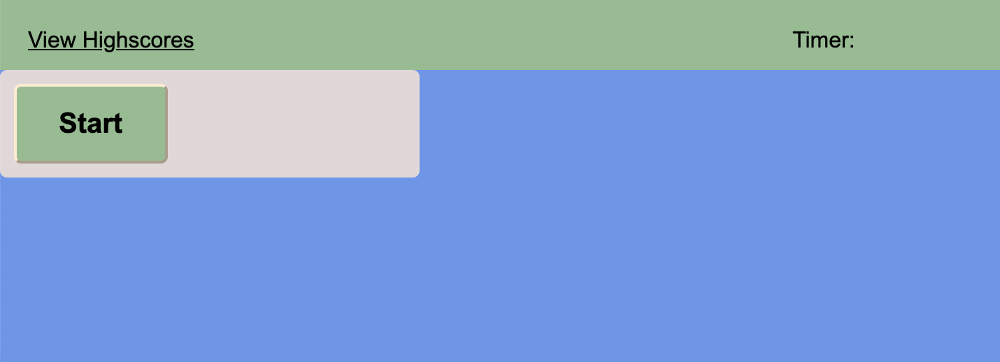

# Spelling Test
live site: https://425megs.github.io/Quiz/index.html 
 
repo: https://github.com/425megs/Quiz

## Your Task

See how quickly you can navigate through this spelling test! The faster you are, the higher score you will get. But make sure to choose the correct spelling, otherwise you'll lose 10 seconds towards your overall score. 

This is a multi-choice quiz. Your timer will begin once the 'Start' button is pushed and you will have 50 seconds to answer 5 spelling-related questions. The time remaining ends up being your score. If you answer a question incorrectly, 10 seconds will be deducted from the time remaining. Once you complete the quiz, you will be be shown your final score and prompted to enter your initials. 

## User Story
AS a user
I WANT to take a timed spelling quiz
SO THAT I can gauge my superior spelling abilities 

---

© 2021 Trilogy Education Services, LLC, a 2U, Inc. brand. Confidential and Proprietary. All Rights Reserved.
